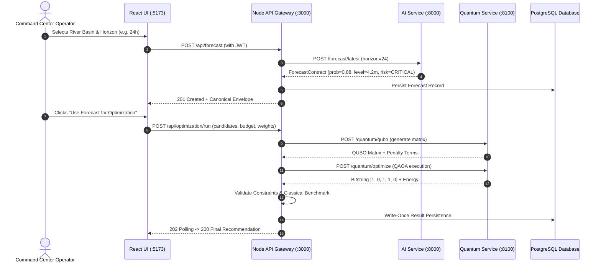

<div align="center">

# 🌊 Q-FLARE
### Quantum-AI Flood Forecasting & Disaster-Response Platform

**A next-generation disaster management command center combining deep hydrological AI forecasting, geospatial 3D intelligence, and quantum QUBO optimization for life-saving emergency operations.**

<br />

<!-- Header Navigation Bar (Website-Style Buttons) -->
<p align="center">
  <a href="#-project-overview"></a>
  <a href="#-where-it-is-required--real-world-applications"></a>
  <a href="#-system-architecture--data-flow"></a>
  <a href="#-3d-visualization--gis-spatial-intelligence"></a>
  <a href="#-single-env-requirements"></a>
  <a href="#-step-by-step-execution-guide"></a>
  <a href="#-help-troubleshooting--faq"></a>
</p>

<!-- Technology Stack Badges -->
<p align="center">
  
  
  
  
  
  
  
  
</p>

</div>

---

## 🏠 Project Overview

**Q-FLARE** (*Quantum-AI Flood Forecasting & Disaster-Response Platform*) is an enterprise command-center system designed to solve the critical challenges of flood prediction, sensor infrastructure deployment, and emergency disaster relief coordination.

### The Problem
During severe monsoons, cloudbursts, and tropical cyclones:
- Traditional hydrological hydrodynamic models take hours to compute water surface profiles, creating unacceptable latency during flash floods.
- Flood monitoring agencies have limited capital budgets ($B$) and cannot place sensors everywhere; choosing optimal locations among hundreds of candidate sites is an **NP-hard combinatorial optimization problem**.
- First responders lack integrated situational awareness connecting forecast predictions, 3D topographical flood inundation, road network accessibility, and hospital/shelter logistics.

### The Q-FLARE Solution
1. **AI Hydrological Inference Engine**: High-frequency, deterministic and deep learning (GRU/LSTM/XGBoost) inference delivering 24–72 hour flood probability, predicted peak water levels, and alert tiers within milliseconds.
2. **Quantum Combinatorial Optimization (QUBO/QAOA)**: Formulates sensor placement as a Quadratic Unconstrained Binary Optimization problem mapped to Ising Hamiltonians. Solved using Quantum Approximate Optimization Algorithm (QAOA) surrogates and classical reference solvers with strict fallback guarantees.
3. **Geospatial 3D & GIS Intelligence**: Topographical flood plain mapping, Digital Elevation Models (DEM), river basin network topology (Krishna-Godavari River Basin), and dynamic evacuation route planning.
4. **Resilient Gateway & Zero-Fabrication Guarantee**: Built upon the platform pledge: *honest by construction* — no fabricated metrics, explicit fallback indicators, and write-once cryptographic result auditing.

---

## 🎯 Where It Is Required & Real-World Applications

Q-FLARE is purpose-built for mission-critical deployment across several operational domains:

```
┌────────────────────────────────────────────────────────────────────────────────────────┐
│                               OPERATIONAL DEPLOYMENT SPHERES                           │
├──────────────────────────┬──────────────────────────┬──────────────────────────────────┤
│  🌊 Major River Basins   │ 🏛️ Disaster Authorities │ 🏥 Civil Infrastructure & First  │
│     & Catchment Areas    │    (NDMA / SDMA / CWC)   │    Responders                    │
├──────────────────────────┼──────────────────────────┼──────────────────────────────────┤
│ • Krishna & Godavari     │ • State Emergency Op     │ • Hospital accessibility route   │
│   Basin floodplains      │   Centers (SEOC)         │   safeguarding                   │
│ • Deltaic flash-flood    │ • Central Water Comm.    │ • Relief shelter allocation      │
│   inundation corridors   │   (CWC) alert bulletin   │ • Submerged arterial road        │
│ • Hydroelectric dam      │ • Early evacuation       │   closure advisories             │
│   reservoir spillways    │   dispatch orders        │ • Drone & boat rescue routing    │
└──────────────────────────┴──────────────────────────┴──────────────────────────────────┘
```

### 1. River Basin Management Authorities (e.g., Central Water Commission, River Boards)
- **Use Case**: Continuous stream gauge monitoring, upstream runoff forecasting, and early flood warnings 24 to 72 hours before river cresting.
- **Why Needed**: Enables controlled dam releases to prevent sudden downstream catastrophic flooding.

### 2. State & National Disaster Management Authorities (NDMA / SDMA)
- **Use Case**: Live tactical command center during severe cyclone landfall and monsoon downpours.
- **Why Needed**: Automates risk classification (`LOW`, `MEDIUM`, `HIGH`, `CRITICAL`) and gives operational leaders verifiable data for evacuations.

### 3. Municipal Corporations & Smart Cities
- **Use Case**: Urban flood monitoring and storm-water drainage surveillance.
- **Why Needed**: Identifies candidate street junctions for low-cost IoT sensor deployment to maximize network coverage without exceeding budget constraints.

### 4. Emergency Healthcare & Humanitarian Relief Teams
- **Use Case**: Evacuation shelter capacity management and arterial road access validation.
- **Why Needed**: Prevents sending rescue ambulances down flooded or blocked transit corridors.

---

## 🏗️ System Architecture & Data Flow

Q-FLARE uses a microservice topology where the browser interacts exclusively with a high-throughput Node.js API Gateway, which coordinates specialized AI, Quantum, GIS, and Database services.

```
┌────────────────────────────────────────────────────────────────────────────────────────┐
│                           FRONTEND COMMAND CENTER (React 19 + Vite)                    │
│     • AI Analytics Dashboard               • Quantum Optimization Pipeline             │
│     • GIS Spatial Intelligence (3D/2D)     • Model Comparison Registry                 │
│     • IoT Real-Time Telemetry              • Disaster Response Planning                │
└───────────────────────────────────────────┬────────────────────────────────────────────┘
                                            │ HTTP / JSON (via Vite /api proxy)
                                            ▼
┌────────────────────────────────────────────────────────────────────────────────────────┐
│                        NODE.JS API GATEWAY & ORCHESTRATOR (:3000)                      │
│     • Express 5 Gateway            • JWT Auth & RBAC (Admin, Operator, Viewer)         │
│     • 15-Step Optimization Pipe    • Resilient Fallback Engine                         │
│     • Rate Limiter & Zod Defense   • Audit Trail & Cryptographic Verification          │
└────────────┬──────────────────────────────┬──────────────────────────────┬─────────────┘
             │                              │                              │
             ▼                              ▼                              ▼
┌──────────────────────────┐  ┌──────────────────────────┐  ┌──────────────────────────┐
│   AI FORECAST SERVICE    │  │  QUANTUM QAOA SERVICE    │  │  POSTGRESQL / SUPABASE   │
│      (FastAPI :8000)     │  │      (FastAPI :8100)     │  │       (Port 6543/5432)   │
├──────────────────────────┤  ├──────────────────────────┤  ├──────────────────────────┤
│ • Deterministic Contract │  │ • QUBO Construction     │  │ • Forecast Records       │
│ • GRU/LSTM Hydro Engine  │  │ • QAOA Simulation        │  │ • Model Registry         │
│ • Risk Classification    │  │ • Qiskit Aer / Hardware  │  │ • Optimization Runs      │
│ • Water Level Horizons   │  │ • Classical Solvers      │  │ • QUBO Matrix Artifacts  │
└──────────────────────────┘  └──────────────────────────┘  └──────────────────────────┘
             ▲                              ▲                              ▲
             └──────────────────────────────┴──────────────────────────────┘
                                            │
                                ┌───────────┴───────────┐
                                │ GIS & IOT DATA LAYERS │
                                │ • River Basin GeoJSON │
                                │ • DEM 3D Elevations   │
                                │ • Telemetry Ingestion │
                                └───────────────────────┘
```

### End-to-End Workflow



---

## 🌐 3D Visualization & GIS Spatial Intelligence

The Q-FLARE platform incorporates spatial intelligence to turn raw hydrological numbers into intuitive geographic and topological visualizations:

```
┌────────────────────────────────────────────────────────────────────────────────────────┐
│                             SPATIAL & TOPOLOGICAL LAYERS                               │
├────────────────────────────────────────────────────────────────────────────────────────┤
│  🏔️ 3D Digital Elevation Models (DEM)                                                 │
│     • Visualizes terrain contours and elevation slopes across river catchments.       │
│     • Highlights low-lying depression basins vulnerable to rapid accumulation.         │
├────────────────────────────────────────────────────────────────────────────────────────┤
│  🌊 Hydrological River Basin Networks (Krishna-Godavari)                              │
│     • GeoJSON-based vectors depicting main channels, tributaries, and dams.           │
│     • Identifies bottleneck river reaches where gauge measurements are most critical. │
├────────────────────────────────────────────────────────────────────────────────────────┤
│  📍 Candidate Sensor Placement Scatter Visualizer                                     │
│     • Projects candidate coordinates $(x, y)$ onto interactive 2D/3D map bounds.       │
│     • Differentiates selected vs unselected sites, overlaid with flood-risk heat.      │
├────────────────────────────────────────────────────────────────────────────────────────┤
│  🧮 QUBO Interaction Matrix Heatmaps                                                   │
│     • Visualizes the quadratic coupling coefficients $Q_{ij}$ in interactive 2D/3D.    │
│     • Color-codes pairwise interference, coverage redundancy, and penalty energy.     │
├────────────────────────────────────────────────────────────────────────────────────────┤
│  🚑 Evacuation & Emergency Infrastructure Corridors                                   │
│     • Live overlays of hospital safe zones, relief shelters, and blocked roads.       │
│     • Proximity matrices ensure optimal distribution of medical and food supplies.     │
└────────────────────────────────────────────────────────────────────────────────────────┘
```

---

## ⚙️ Single `.ENV` Requirements

The entire project operates from a **single, unified configuration file** located at the project root:
[`/.env`](file:///.env).

All sub-services (`backend`, `ai-service`, `quantum-service`, and `frontend`) load from this single root file.

### Complete `.env` Reference Table

| Category | Variable Name | Default / Example Value | Description & Operational Requirement |
| :--- | :--- | :--- | :--- |
| **System** | `NODE_ENV` | `development` | Runtime environment mode (`development`, `production`, `test`). |
| **Backend** | `PORT` | `3000` | HTTP listener port for the Node.js API Gateway. |
| **Backend** | `DATABASE_MODE` | `postgres` | `postgres` for live PostgreSQL/Supabase; `memory` for standalone demo/tests. |
| **Backend** | `DATABASE_URL` | `postgresql://...` | Connection string for PostgreSQL database. |
| **Backend** | `AUTH_ENABLED` | `false` | When `false`, all features are directly accessible (no login required). Set to `true` to enable JWT-gated access. |
| **Backend** | `JWT_SECRET` | *(32+ char secret)* | Secret key used to sign and verify JSON Web Tokens. |
| **Backend** | `JWT_EXPIRES_IN` | `800h` | Lifetime window for issued authentication tokens. |
| **Backend** | `FRESHNESS_STALE_MS` | `90000` | Telemetry staleness threshold in ms (triggers degraded warning). |
| **Backend** | `RATE_LIMIT_WINDOW_MS`| `60000` | Window time for rate limiting (1 minute). |
| **Backend** | `RATE_LIMIT_MAX` | `1200` | Maximum allowable requests per IP within the window. |
| **Backend** | `MODEL_SELECTION_METRIC`| `r2` | Primary metric for ranking models (`r2`, `rmse`, `mae`, `nse`). |
| **Backend** | `OPTIMIZATION_FALLBACK_POLICY`| `retry_simulator` | Fallback behavior when quantum executor is down (`retry_simulator`, `classical_only`, `error`). |
| **Backend** | `OPTIMIZATION_EXECUTION_TIMEOUT_MS`| `120000` | Maximum wall-clock timeout (2 minutes) for an optimization run. |
| **Backend** | `OPTIMIZATION_EXHAUSTIVE_LIMIT`| `18` | Candidate threshold for brute-force classical solver comparison. |
| **Backend** | `OPTIMIZATION_QUBO_INLINE_LIMIT`| `12` | Matrix dimension cap for inline storage vs file artifact storage. |
| **Backend** | `OPTIMIZATION_RUN_LIMIT_MAX`| `10` | Rate limit cap specifically for heavy optimization runs. |
| **AI Service** | `AI_SERVICE_HOST` | `0.0.0.0` | Host IP for FastAPI AI Forecasting service. |
| **AI Service** | `AI_SERVICE_PORT` | `8000` | HTTP listener port for FastAPI AI Forecasting service. |
| **AI Service** | `AI_SERVICE_URL` | `http://localhost:8000` | URL used by Node gateway to connect to AI service. |
| **AI Service** | `AI_REQUEST_TIMEOUT_MS`| `5000` | Timeout in ms for backend HTTP calls to AI service. |
| **AI Service** | `FORECAST_ENGINE` | `reference` | Model engine: `reference` (deterministic) or class path (e.g. `pipeline.modules.gru:GruFloodNetEngine`). |
| **AI Service** | `AI_SERVICE_CORS_ORIGINS`| `*` | CORS origins permitted to invoke the AI service. |
| **Quantum** | `QUANTUM_SERVICE_HOST`| `0.0.0.0` | Host IP for FastAPI Quantum Optimization service. |
| **Quantum** | `QUANTUM_SERVICE_PORT`| `8100` | HTTP listener port for FastAPI Quantum service. |
| **Quantum** | `QUANTUM_SERVICE_URL` | `http://localhost:8100` | URL used by Node gateway to connect to Quantum service. |
| **Quantum** | `QUANTUM_REQUEST_TIMEOUT_MS`| `15000` | Timeout in ms for backend calls to Quantum service. |
| **Quantum** | `QUANTUM_SERVICE_CORS_ORIGINS`| `*` | CORS origins permitted to invoke the Quantum service. |
| **Quantum** | `QUANTUM_QUBO_DISABLED`| `false` | Drill knob: simulates QUBO 503 error to test fallback ladder. |
| **Quantum** | `QUANTUM_FORCE_AER_DOWN`| `false` | Drill knob: forces Aer executor failure to verify simulator fallback. |
| **Quantum** | `QUANTUM_FORCE_HARDWARE_DOWN`| `false` | Drill knob: forces IBM QPU failure to test local fallback. |
| **Quantum** | `QUANTUM_FALLBACK_ENABLED`| `false` | Intra-job fallback switch in quantum-service. |
| **Quantum** | `QUANTUM_DB_PATH` | `""` | SQLite path for quantum jobs (empty = in-memory). |
| **Quantum** | `QUANTUM_API_TOKEN` | `""` | Optional bearer token for quantum service endpoint defense. |
| **Quantum** | `QUANTUM_JOB_DELAY_MS`| `0` | Delay in ms to observe queued/running states in live demos. |
| **Quantum** | `QUANTUM_RESULT_WAIT_MS`| `30000` | Polling wait time for terminal QAOA state. |
| **Quantum** | `QISKIT_IBM_TOKEN` | `""` | Optional IBM Quantum Cloud API token for physical QPUs. |
| **Frontend** | `VITE_API_BASE_URL` | `""` | Base API URL (empty uses Vite proxy to `http://localhost:3000`). |
| **Frontend** | `VITE_USE_MOCK_DATA` | `false` | Set to `false` for live backend data; `true` forces mock adapter. |

---

## 🚀 Step-by-Step Execution Guide

Follow these steps to run all 4 microservices simultaneously.

```
┌────────────────────────────────────────────────────────────────────────────────────────┐
│                               SERVICE LAUNCH SUMMARY                                   │
├─────────────┬───────────────────────────┬──────────────────────┬───────────────────────┤
│ Window      │ Service                   │ Command              │ Endpoint              │
├─────────────┼───────────────────────────┼──────────────────────┼───────────────────────┤
│ Terminal 1  │ AI Forecasting (FastAPI)  │ uvicorn app.main:app │ http://localhost:8000 │
│ Terminal 2  │ Quantum Service (FastAPI) │ uvicorn app.main:app │ http://localhost:8100 │
│ Terminal 3  │ Backend Gateway (Node.js) │ npm run dev          │ http://localhost:3000 │
│ Terminal 4  │ Frontend UI (React/Vite)  │ npm run dev          │ http://localhost:5173 │
└─────────────┴───────────────────────────┴──────────────────────┴───────────────────────┘
```

### Step 1: Verify the Root `.env` File
Ensure that the single unified `.env` file exists at the root of the project:
```powershell
# In PowerShell (Windows)
Test-Path .env
# Returns: True
```

---

### Step 2: Start the AI Forecasting Service
Open a **new terminal window** (Terminal 1):
```powershell
cd ai-service

# Create and activate Python virtual environment
python -m venv .venv
.venv\Scripts\Activate.ps1               # On Linux/macOS: source .venv/bin/activate

# Install dependencies
pip install -r requirements.txt

# Start FastAPI server on port 8000
python -m uvicorn app.main:app --host 0.0.0.0 --port 8000
```
- **Check Health**: Open `http://localhost:8000/health` in your browser. Expected response:
  ```json
  {"success": true, "data": {"service": "ai-service", "version": "1.0.0", "engine": "reference", "status": "online"}}
  ```

---

### Step 3: Start the Quantum Optimization Service
Open a **second terminal window** (Terminal 2):
```powershell
cd quantum-service

# Create and activate Python virtual environment
python -m venv .venv
.venv\Scripts\Activate.ps1               # On Linux/macOS: source .venv/bin/activate

# Install dependencies
pip install -r requirements.txt

# Start FastAPI server on port 8100
python -m uvicorn app.main:app --host 0.0.0.0 --port 8100
```
- **Check Health**: Open `http://localhost:8100/health` in your browser. Expected response:
  ```json
  {"status": "ok", "service": "quantum-service", "version": "1.0.0"}
  ```

---

### Step 4: Start the Node.js API Gateway (Backend)
Open a **third terminal window** (Terminal 3):
```powershell
cd backend

# Install npm dependencies
npm install

# Start Express server with tsx hot-reloading
npm run dev
```
- **Gateway Console Output**:
  ```text
  [backend] listening on http://localhost:3000 (auth: disabled, mode: postgres)
  ```
- **Check Analytics Endpoint**: Open `http://localhost:3000/api/ai/analytics` in your browser.

---

### Step 5: Start the React Frontend Command Center
Open a **fourth terminal window** (Terminal 4):
```powershell
cd frontend

# Install npm dependencies
npm install

# Start Vite dev server on port 5173
npm run dev
```
- **Access Web App**: Navigate to [http://localhost:5173/Quantum-AI-Flood-Forecasting/](http://localhost:5173/Quantum-AI-Flood-Forecasting/) or [http://localhost:5173](http://localhost:5173) in your web browser.

---

### Step 6: Direct Access — No Login Required

Q-FLARE runs in **Direct Command Center** mode by default (`AUTH_ENABLED=false`).
All 8 feature modules are immediately accessible from the navigation bar without any credentials:

| Dashboard | URL Path | Description |
| :--- | :--- | :--- |
| AI Analytics | `/` | Flood probability, risk classification, model metrics |
| Flood Forecasting | `/forecasting` | 24–72h water level horizon predictions |
| GIS Spatial | `/gis` | River basin maps, 3D DEM, flood inundation layers |
| IoT Telemetry | `/iot` | Real-time sensor stream, gauge health, alert feeds |
| Response Planning | `/response` | Shelter routing, evacuation corridors, resource dispatch |
| Model Comparison | `/model-comparison` | Multi-model benchmark leaderboard (GRU, LSTM, XGBoost) |
| Quantum Optimization | `/quantum-optimization` | QAOA sensor placement, QUBO matrix visualizer |
| Quantum Benchmark | `/quantum-benchmark` | Quantum vs classical solver performance comparison |

> **Note:** To re-enable JWT-based role authentication, set `AUTH_ENABLED=true` in the root `.env` and restart the backend. Pre-configured role accounts — `admin / qflare-admin`, `operator / qflare-operator`, `viewer / qflare-viewer` — remain available for secure deployments.

---

## 🧪 Verification & Testing Suite

You can verify all platform layers at any time using the built-in test commands:

```powershell
# 1. Typecheck the backend codebase
cd backend
npx tsc --noEmit

# 2. Run backend test suite (unit tests in memory mode)
npm run test:unit

# 3. Run forecast API contract tests
node --test --test-force-exit --import tsx "tests/features/forecasting/forecast-api.test.ts"

# 4. Build and validate frontend production bundle
cd ..\frontend
npm run build
```

---

## 💡 Help, Troubleshooting & FAQ

### Q1: What happens if PostgreSQL is unreachable or Supabase times out?
> **Answer**: The backend includes an automatic and manual memory fallback. If you are demoing offline or experiencing connection latency, simply change `DATABASE_MODE=memory` in your root [`.env`](file:///.env) file and restart the backend. All features, in-memory repositories, and seed datasets remain fully operational without an external database!

### Q2: I get a PowerShell Execution Policy error when activating `.venv` (`Activate.ps1 cannot be loaded`)
> **Answer**: Run the following command in PowerShell to permit script execution for your session:
> ```powershell
> Set-ExecutionPolicy -Scope Process -ExecutionPolicy RemoteSigned
> ```
> Then re-run `.venv\Scripts\Activate.ps1`.

### Q3: Why is there only ONE `.env` file instead of multiple in each folder?
> **Answer**: Maintaining separate `.env` files across 4 microservices frequently leads to port mismatches, desynchronized JWT secrets, and diverging database strings. Q-FLARE's unified root `.env` serves as a single source of truth across Node.js, Python FastAPI, and Vite React.

### Q4: What happens if the Quantum service is offline during an optimization run?
> **Answer**: The backend implements an honest, resilient fallback ladder (`OPTIMIZATION_FALLBACK_POLICY=retry_simulator`). If the QAOA quantum executor is unavailable, the orchestrator automatically degrades to the verified classical reference solver, marks the job as `simulated`, and surfaces the solution without crashing the user interface.

---

## 📄 License

This project is licensed under the terms of the [Apache License 2.0](LICENSE).